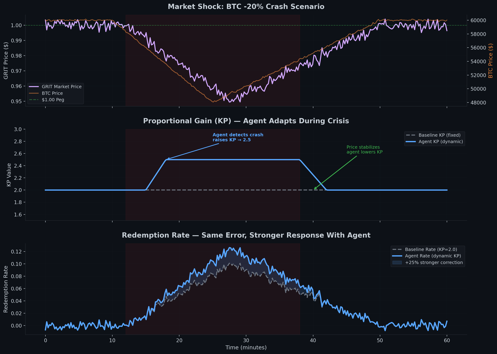

# Grinta

A PID-controlled stablecoin protocol on Starknet. Grinta uses a HAI-style redemption price mechanism with an Ekubo DEX hook that automatically updates rates on every swap — only BTC/USD oracle pushes are manual.

## Architecture

```
                           ┌──────────────────────────────────────────────┐
                    ┌──────┤      Governance Agents Pool           ├───────┐
                    │      │  ┌──────────┐  ┌──────────┐   │       │
                    │      │  │ PID-RL  │  │ GPT-4/  │   │       │
                    │      │  │ (1.5B) │  │Claude   │   │       │
                    │      │  └────┬───┘  └────┬───┘   │       │
                    │      │       │ propose  │       │       │
                    └──────┼───────┴────┬────┴───────┼───────┘
                           │           │            │
                           ▼           │      propose (Kp, Ki)
                    ┌──────────────┐  │      ┌────▼────────┐
                    │ParameterGuard│◄─┴─────│ (any agent) │
                    │ (bounds +    │        └─────────────┘
                    │  apply)     │
                    └──────┬──────┘
                           │ new gains (Kp, Ki)
                           ▼
                      ┌─────────────┐
                      │  Ekubo DEX  │
                      │  (Grit/USDC │
                      │    pool)    │
                      └──────┬──────┘
                             │ after_swap
                      ┌──────▼──────┐       ┌───────────────┐
                      │ GrintaHook  │◄──────│ OracleRelayer │◄─── keeper pushes
                      │ (Extension) │       │ (BTC/USD x128)│     BTC/USD from
                      └──┬───────┬──┘       └───────────────┘     CoinGecko etc.
           market price│       │collateral price
                      ┌──▼───┐   │
                      │ PID  │   │
                      │Ctrl  │   │
                      └──┬───┘   │
               new rate   │       │
                      ┌──▼───────▼──┐
                      │  SAFEEngine  │ ◄── core ledger + Grit ERC20
                      │              │     + redemption price/rate
                      └──────┬──────┘
                             │
               ┌────────────┼────────────┐
               │            │            │
        ┌──────▼──┐  ┌──────▼──┐  ┌────▼─────┐
        │Collateral│  │  Safe   │  │   Grit  │
        │  Join   │  │Manager │  │ (ERC20)│
        │ (WBTC) │  │        │  │        │
        └────────┘  └────────┘  └─────────┘
               │            │
               │    ┌──────▼──────┐
               │    │Liquidation  │ ◄─── permissionless
               ├───│Engine     │     health check
               │    └──────┬──────┘
               │         │
               │    ┌───▼────┐
               │    │Auction │ ◄─── Dutch auction
               │    │House  │     collateral
               │    └──────┘
               │
        ┌──────▼──────────┐
        │ Accounting     │ ◄─── debt/surplus
        │ Engine       │     tracking
        └───────────────┘
```

**Key components:**
- **ParameterGuard** — validates and applies PID gains from any governance agent (local PID-RL or external LLMs)
- **Governance Agents** — PID-RL (local, 1.5B) + external APIs (GPT-4, Claude) via ERC-8004
- **Liquidation system** — LiquidationEngine + CollateralAuctionHouse + AccountingEngine

## Autonomous Governance: PID-RL Agent

Grinta includes an **autonomous AI governor** that dynamically tunes PID controller gains (Kp, Ki) based on market volatility — no manual parameter tuning required.

See the [trained model](https://huggingface.co/Fenryr/qwen2.5-1.5B-pid-v1) on HuggingFace and [training code](https://github.com/Grinta-Protocol/qwen-rl-shanghai) on GitHub.

### Why PID-RL?

| Metric | GPT-4/Claude Agent | **PID-RL (Local)** |
|--------|-------------------|-------------------|
| Parameters | 1.7T+ (MoE) | **1.5B** |
| Latency | 2-5s | **<50ms** |
| Cost/run | $0.05-0.15 | **$0.001** |
| JSON validity | ~90% | **100%** |

The PID-RL model is a finetuned Qwen 2.5 1.5B that outputs valid JSON with PID tuning decisions:
```json
{
  "action": "tune_gains",
  "new_kp": 2.8,
  "new_ki": 0.015,
  "is_emergency": false,
  "reasoning": "BTC dropped 4% in 1h. Increasing Kp for faster convergence."
}
```

**Where RL adds value:**
1. **Dynamic gain tuning** — Kp/Ki automatically adjust based on BTC volatility
2. **Emergency detection** — model identifies market crashes and proposes aggressive corrections
3. **Cost reduction** — 50-100x cheaper than API-based LLMs
4. **Self-hosted** — governance data never leaves your infrastructure
5. **Offline capable** — runs locally, no external API dependency



**Chart Description:** Multi-panel simulation of a -20% BTC crash scenario:

1. **Panel 1 — Market Shock:** BTC crashes -20% at minute ~10, GRIT dips below $1.00 peg but recovers
2. **Panel 2 — Agent Response:** Agent detects crash at minute ~10, spikes KP from 2.0 → 2.5 (+25%), then lowers as price stabilizes
3. **Panel 3 — Redemption Rate:** With dynamic KP, rate peaks +25% higher than baseline, enabling faster peg recovery

The agent intervention happens at the same timestamp as the market shock, creating a higher redemption rate that pulls GRIT back toward $1.00.

## Contracts (10 core + 2 mocks)

| Contract | Lines | Role |
|---|---|---|
| SAFEEngine | 565 | Core ledger, Grit ERC20, redemption price/rate, confiscation |
| CollateralJoin | 188 | WBTC custody, decimal conversion, seizure |
| PIDController | 382 | HAI-style PI with leaky integrator and noise barrier |
| GrintaHook | 376 | Ekubo `after_swap` extension — price discovery + PID orchestration |
| SafeManager | 220 | User/agent-facing: open, deposit, borrow, repay, delegate |
| OracleRelayer | 95 | BTC/USD price feed (WAD + x128) |
| ParameterGuard | ~150 | Governance: validates bounds, applies Kp/Ki from agents |
| LiquidationEngine | 246 | Permissionless liquidation, health check, auction kickoff |
| CollateralAuctionHouse | 316 | Dutch auction for seized collateral |
| AccountingEngine | 152 | Debt/surplus tracking, GRIT burn settlement |

Total: ~2,540 lines. Full mechanism design and parameters in [DESIGN.md](./DESIGN.md).

## Sepolia Deployment (V11 — Current)

All V11 addresses are in [`deployed_v11.json`](./deployed_v11.json). Deployment history (V9 → V11) and live ParameterGuard policy in [PROTOCOL_STATUS.md](./PROTOCOL_STATUS.md).

Pool: USDC(token0)/GRIT(token1), fee=0, tick_spacing=1000, extension=GrintaHook
Init tick is computed dynamically based on token address ordering — see [INVARIANTS.md](./INVARIANTS.md) for the tick math (Ekubo uses base 1.000001, not Uniswap's 1.0001) and the sign rule (NEGATIVE when token0 has more decimals than token1).

Live policy (2026-04-25, conservative): Kp ∈ [3.33e-7, 1e-6] WAD around baseline 6.67e-7 (~20% annualized at 1% deviation), 10% per-call delta caps. The agent nudges; it does not panic-jump.

External dependencies (Sepolia):
- Ekubo Core: `0x0444a09d96389aa7148f1aada508e30b71299ffe650d9c97fdaae38cb9a23384`
- Ekubo Router V3: `0x0045f933adf0607292468ad1c1dedaa74d5ad166392590e72676a34d01d7b763`
- Ekubo Positions: `0x06a2aee84bb0ed5dded4384ddd0e40e9c1372b818668375ab8e3ec08807417e5`
- Ekubo Oracle: `0x003ccf3ee24638dd5f1a51ceb783e120695f53893f6fd947cc2dcabb3f86dc65`

## Building

```bash
scarb build          # Build contracts
snforge test         # Run tests (70/70 passing)
```

## Deploying

```bash
chmod +x scripts/deploy_sepolia_v11.sh
./scripts/deploy_sepolia_v11.sh  # Declares, deploys, wires permissions, registers hook, creates pool
```

For demo→prod parameter migration, see [V11_PROD_CHECKLIST.md](./V11_PROD_CHECKLIST.md). For policy resets without redeploy, see [`app/scripts/apply-conservative-policy.ts`](./app/scripts/apply-conservative-policy.ts) (loosen → propose → retighten pattern).

## Documentation

| File | Contents |
|---|---|
| [DESIGN.md](./DESIGN.md) | Full mechanism design, math, PID parameters, liquidation system |
| [INVARIANTS.md](./INVARIANTS.md) | Critical invariants and failure modes discovered during deployment |
| [ORACLE_DESIGN.md](./ORACLE_DESIGN.md) | Oracle architecture, price feeds, future Ekubo TWAP research |
| [PROTOCOL_STATUS.md](./PROTOCOL_STATUS.md) | What's built, what's next, roadmap |

## Dependencies

- Cairo 2.14.0 / Starknet
- OpenZeppelin Contracts (token, access) 1.0.0
- snforge 0.53.0 (testing)
- sncast 0.53.0 (deployment)

## License

MIT
